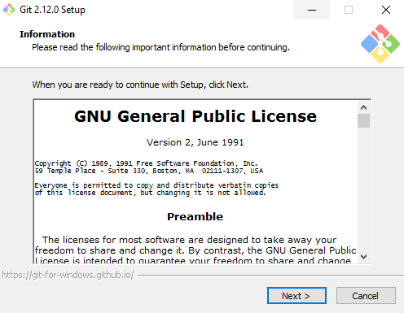

# Инструкция по работе с Git
---
## Содержание
1. [Главная](./readme.md)
1. [Установка Git на Windows](./install.md)
1. [Настройки по умолчанию](./defaultconfig.md)
1. [Файл .gitignore](./ignore.md)
1. [Создание репозитория](./createrepo.md)
1. [Состояние файлов](./filestatus.md)
1. [Работа с коммитами](./commit.md)
1. [Просмотр истории](./commithistory.md)
1. [Работа с удалённым репозиторием](./remoterepo.md)
1. [Ветвление в Git](gitbranch.md)
---
## Установка GIT на Windows

Установка **GIT** на Windows, осуществляется так же просто, как и установка любого другого приложения; загрузка установщика и его запуск.  Выполните данные шаги для установки **GIT** на Windows:

* Посетите [этот сайт](https://gitforwindows.org/) и скачайте установщик GIT для Windows.
* После загрузки запустите установку двойным нажатием мыши. * Следуйте инструкциям на экране, продолжайте нажимать Next (Далее) и, наконец, Finish (Финиш) для успешного завершения установки.


* Запустите командную строку и впишите следующие команды в терминале:
```Bash
git config --global user.name "John Smith"
git config --global user.email "example@email.com"
```
Не забудьте изменить John Smith и example@email.com на ваши собственные личные данные. Любые впоследствии созданные коммиты будут связаны с этими данными.


Это все что нужно для установки GIT на Windows.